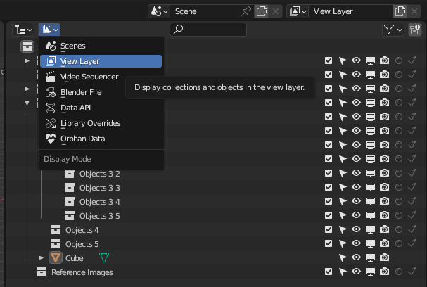
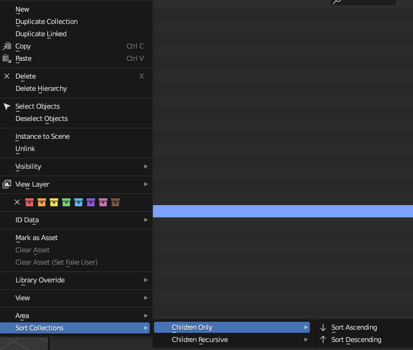

Blender addon enabling sorting of collections from outliner via context menus based on BSE https://blender.stackexchange.com/questions/311294/collections-in-alphabetical-order/311295#comment539659_311295

Sorting functions added to context menus for 'OUTLINER'.

* OUTLINER_MT_collection
* OUTLINER_MT_collection_new (required when sorting from master scene collection)

Sorting ascending or descending.

Sorting direct children or recursive from active layer collection.

## Limitation Outliner display mode must be set to 'VIEW_LAYER'.

# General Operation
Right click on a collection in the outliner (this will be considered the parent collection for operations).

At the bottom of the context popup menu you will see an option for "Sort Collections" which expands to available options.
