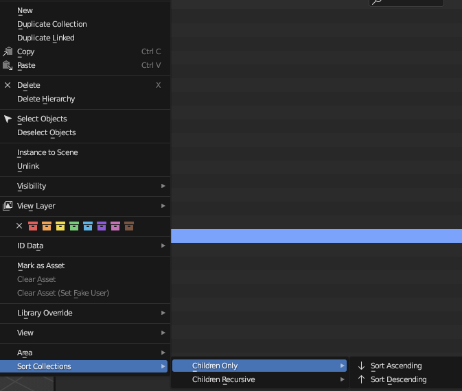

As an update to the original answer (at bottom) I am providing a more fully functional script as follows.

Sorting functions added to context menus for 'OUTLINER'.

* OUTLINER_MT_collection
* OUTLINER_MT_collection_new (required when sorting from master scene collection)

Sorting ascending or descending.

Sorting direct children or recursive from active layer collection.

## Limitation Outliner display mode must be set to 'VIEW_LAYER'.


# General Operation
Right click on a collection in the outliner (this will be considered the parent collection for operations).



At the bottom of the context popup menu you will see an option for "Sort Collections" which expands to available options.

# Script

```
bl_info = {
    "name": "VL_Sort",
    "author": "Nezumi",
    "version": (0, 0, 2),
    "blender": (4, 0, 2),
    "location": "Outliner > rightclick menu > Sort Collections",
    "description": "Sort layer collections in outliner",
    "warning": "",
    "wiki_url": "",
    "category": "Interface",
}

import bpy


class USER_OT_sort_colls(bpy.types.Operator):
    bl_idname = 'user.sort_colls'
    bl_label = "Sort Collections"

    reverse: bpy.props.BoolProperty(default=False)
    recursive_children: bpy.props.BoolProperty(default=False)

    @classmethod
    def poll(cls, context):
        area = [a for a in context.screen.areas if a.type == 'OUTLINER'][0]
        cond = area.spaces[0].display_mode == 'VIEW_LAYER'
        return cond

    def execute(self, context):
        m_vcoll = context.view_layer.layer_collection.collection
        start_coll = context.view_layer.active_layer_collection.collection

        def sort_child_colls(p_vcoll, rev = False):
            c_vcolls = p_vcoll.children
            s_vcolls = sorted(c_vcolls.keys(), reverse = rev)
            for vcoll in c_vcolls:
                c_vcolls.unlink(vcoll)
            for k in s_vcolls:
                c_vcolls.link(bpy.data.collections.get(k))

        def sort_child_rec(p_vcoll = m_vcoll, rev = False):
            c_vcolls = p_vcoll.children_recursive
            for coll in list(c_vcolls):
                if len(coll.children) == 0:
                    c_vcolls.remove(coll)
            for coll in c_vcolls:
                sort_child_colls(coll, rev)
            sort_child_colls(p_vcoll, rev)
        
        if not self.recursive_children:
            sort_child_colls(start_coll, self.reverse)
        else:
            sort_child_rec(start_coll, self.reverse)
        return {'FINISHED'}


class USER_MT_vlsort_sub1(bpy.types.Menu):
    bl_label = 'Children Only'
    bl_idname = 'USER_MT_vlsort_sub1'

    def draw(self, context):
        layout = self.layout
        sort_c_asc = layout.operator("user.sort_colls", text="Sort Ascending", icon='SORT_ASC')
        sort_c_asc.reverse = False
        sort_c_asc.recursive_children = False
        sort_c_desc = layout.operator("user.sort_colls", text="Sort Descending", icon='SORT_DESC')
        sort_c_desc.reverse = True
        sort_c_desc.recursive_children = False


class USER_MT_vlsort_sub2(bpy.types.Menu):
    bl_label = 'Children Recursive'
    bl_idname = 'USER_MT_vlsort_sub2'

    def draw(self, context):
        layout = self.layout
        sort_r_asc = layout.operator("user.sort_colls", text="Sort Ascending", icon='SORT_ASC')
        sort_r_asc.reverse = False
        sort_r_asc.recursive_children = True
        sort_r_desc = layout.operator("user.sort_colls", text="Sort Descending", icon='SORT_DESC')
        sort_r_desc.reverse = True
        sort_r_desc.recursive_children = True


class USER_MT_vlsort_main(bpy.types.Menu):
    bl_label = 'Sort Collections'
    bl_idname = 'USER_MT_vlsort_main'

    def draw(self, context):
        layout = self.layout
        layout.menu(USER_MT_vlsort_sub1.bl_idname)
        layout.menu(USER_MT_vlsort_sub2.bl_idname)


def menu_item_draw_func_sort(self, context):
    layout = self.layout
    layout.menu("USER_MT_vlsort_main")


classes = [
    USER_OT_sort_colls,
    USER_MT_vlsort_sub1,
    USER_MT_vlsort_sub2,
    USER_MT_vlsort_main,
    ]


def register():
    for cls in classes:
        bpy.utils.register_class(cls)
    bpy.types.OUTLINER_MT_collection.append(menu_item_draw_func_sort)
    bpy.types.OUTLINER_MT_collection_new.append(menu_item_draw_func_sort)


def unregister():
    for cls in classes:
        bpy.utils.unregister_class(cls)

if __name__ ==  '__main__':
    register()
```

Below is an ugly script but should be functional in blender 3.x and 4.x. Note this only affects the 1st hierarchy level not recursive levels.

```
import bpy
C = bpy.context

vcols = C.view_layer.layer_collection.collection.children
s_vcols = sorted(vcols.keys())

for vcol in vcols:
    vcols.unlink(vcol)

for k in s_vcols:
    vcols.link(bpy.data.collections.get(k))
```